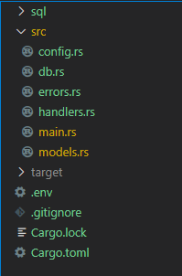

## This post

My goal in this post is to show some basic user registration (User actix handlers and calls to postgres) and session management using session tokens and actix_session to store them on the client.

## Disclaimer

I am learning Rust and do not pretend that this is the best solution or even particularly good Rust code.

## Folder structure (git repo linked below)




## Database schema

Schema to handle users, sessions, cards and trades.

[SQL Schema](https://github.com/dbetteridge/actix-session-example/blob/master/sql/schema.sql)

## Registering a new user

First we define a user model and map it to our users table.
```rust
  #[derive(Deserialize, PostgresMapper, Serialize, Debug)]
  #[pg_mapper(table = "users")] // singular 'user' is a keyword..
  pub struct User {
      pub email: String,
      pub name: String,
      pub username: String,
      pub password: String,
  }
```

Next we define a handler which is responsible for taking the HTTP request and returning some kind of response.  
In our example here we receive a user object as JSON and convert it into proper rust construct.  
We then hash the password provided, writing this back into the User object in place of the plaintext password.  
This user is stored into the database and the result returned as JSON to the API caller.

```rust
  pub async fn add_user(
      user: web::Json<User>,
      db_pool: web::Data<Pool>,
  ) -> Result<HttpResponse, Error> {
      let mut user_info: User = user.into_inner();
      let hashed = hash(&user_info.password, DEFAULT_COST).unwrap();
      user_info.password = hashed;
      let client: Client = db_pool.get().await.map_err(MyError::PoolError)?;
      let new_user = db::add_user(&client, user_info).await?;
      Ok(HttpResponse::Ok().json(new_user))
  }
```

The actual code run in `db::add_user` is shown below.  
the `iter().map().collect().pop()` step is necessary to convert the returned rows from a postgres datastructure to a valid User model 
then collect them up into a Rust Vector and return the top result.  
We could alternatively use `.query_one` and convert that directly.

```rust
pub async fn add_user(client: &Client, user_info: User) -> Result<User, MyError> {
    let _stmt = include_str!("../sql/add_user.sql");
    let _stmt = _stmt.replace("$table_fields", &User::sql_table_fields());
    let stmt = client.prepare(&_stmt).await.unwrap();

    client
        .query(
            &stmt,
            &[
                &user_info.email,
                &user_info.name,
                &user_info.username,
                &user_info.password,
            ],
        )
        .await?
        .iter()
        .map(|row| User::from_row_ref(row).unwrap())
        .collect::<Vec<User>>()
        .pop()
        .ok_or(MyError::NotFound)
}
```

## Session Handler and database function

The core of the session handling can be found in main.rs and handlers.rs login function

```rust
  .wrap(CookieSession::signed(&[0; 32]).secure(false))
```
Uses actix-session to create a cookie, This cookie also allows us to set values much like using localStorage in the browser. 
[Full function](https://github.com/dbetteridge/actix-session-example/blob/master/src/main.rs#L24)

```rust
  let db_session = db::login(&client, user_info).await?;
  session.set("session", db_session.token)?;
```
Here we are taking the session token returned from the database login call and setting it in our session cookie for later use.
[Full function](https://github.com/dbetteridge/actix-session-example/blob/master/src/handlers.rs#L30)

```rust
  let session_token = session.get("session").unwrap().unwrap_or_default();
  db::auth(&client, session_token).await
```
We extract the session token from the session cookie and check it against the database to see if it exists and hasn't expired.
If it is valid we return the User associated with that token.
[Full function](https://github.com/dbetteridge/actix-session-example/blob/master/src/handlers.rs#L116)

```rust
  match auth(session, db_pool.clone()).await {
          Ok(user) => {
            let client: Client = db_pool.get().await.map_err(MyError::PoolError)?;
                let db_trades = db::trades(&client, &user).await?;
                Ok(HttpResponse::Ok().json(db_trades))
          }
          Err(err) => Err(err),
  }
```
We run the above auth check and use the returned user object when auth is successful or throw an error if it fails.
[Full function](https://github.com/dbetteridge/actix-session-example/blob/master/src/handlers.rs#L63)

## End

And thats it, a simple user registration and session auth using actix.  
My next goal is re-write this using the actix actor model, so if that interests you keep an eye out for part 2.


## Codebase

[Github Repo](https://github.com/dbetteridge/actix-session-example)