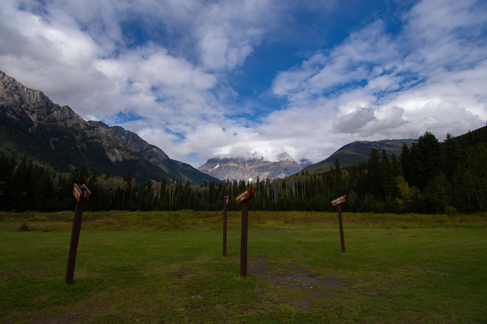

First part of my honeymoon road trip across Canada, Starting in Vancouver.

Starting with a few days in Vancouver to recover from the 43 hours of travel from Perth, we had a few days wandering around Vancouver and trying the food.
On our last day we took a daytrip up the coast and back, stopping along the way for a short forest hike for some photos.

## Vancouver Daytrip

Next up was a cruise from Vancouver up to Anchorage, stopping in Juneau, Seward, Ketchikan and Icy strait point.
The whale watching trip was 100% worth the cost, we saw over 20 different whales over a few short hours.

Skagways White pass train had some amazing mountainside views.

Finally the Hubbard Glacier was absolutely stunning, the weather was clear and allowed hearing the soft crinkling of the ice in the water.

Approaching the glacier even without binoculars we could see chunks of ice falling from the glacier and launching water hundreds of metres into the air with a thundering roar.

## Vancouver To Anchorage

A few days spent tripping around Alaska from Anchorage to Skagway provided some stunning views and some very chilly camping sites.

First night was spent in the Denali national park, We didnt have time to go further in (Due to the bus system) but managed to get a great view of Denalis peak and some amazing Autumns red foliage.

## Alaska Roadtrip

After meeting up with my brother and brother in law in Skagway we crossed the border into Canada!

First stop Takhini River Hot springs, lovely campground amongst the trees and a great dip in the hot spring to warm up before bed.

Made a daytrip to Yukon Wildlife Preserve to see some of the more skittish animals up close.

We had an overnight stay in Fort Nelson and got some fantastic Aurora views from the campsite.

Final stop on this leg of the journey was Hay River campground, just a short walk from the shore of Great Slave Lake. We stayed up until 4am to the peak of the Aurora activity and managed to get some amazing shots.

## Whitehorse to Jasper

Next up we headed down to Jasper national park.

## Jasper

