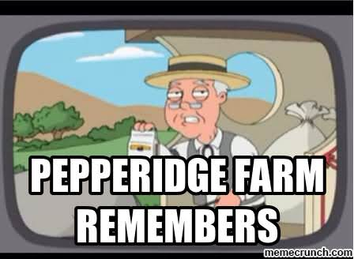

## Trust on the web

Do you remember the internet before walled garden social networks, fake news and useless search results?

### Who can YOU trust?

Working with a set of massively distributed set of data like the web is complex, people draw different conclusions based on their own set of truths and biases.

This presents a problem, how does someone categorise information online as 'Trustworthy'?

Google has tried to do this for over 20 years now;

Their initial success was in using backlinks a.k.a how many pages link to this page? and their [Pagerank](https://en.wikipedia.org/wiki/PageRank) algorithm.

The assumption being that experts or those knowledgable about the topic will naturally link and reference the relevant pages about it.

This is increasingly failing where content is linked to falsely, generated through automated processes to game rankings or otherwise abused to try and list higher in a Google search.

### The Problem

People Suck.

If theres a way to make money by breaking things for everyone else, someone will go ahead and do it, then once it no longer works write a book on it and make money selling the book.
[Or in this case selling it as a service.](https://www.buzzfeednews.com/article/craigsilverman/google-search-manipulation-online-reputation-expert)

#### The people

The average person does not

1. Understand URL's or care what they are or why
2. Care about the 'Open Web'
3. Stray far outside their walled garden for their content (Facebook, Instagram, Twitter etc)
4. Have the background knowledge or care enough to determine if the content they consume is real or fake

#### The default is ~~un~~trusted

Currently people assess content based on their personal assumptions, perceived knowledge of the topic and the 'credibility' of the site they're viewing [Ref](https://dl.acm.org/doi/pdf/10.1145/765891.765951).

So we run smack-bang into the [Dunning-Kruger](https://en.wikipedia.org/wiki/Dunning%E2%80%93Kruger_effect) effect, those who know a little but not a lot about a topic tend to assume they know more;

Subsequently they assess website credibility using their inherent assumptions, limited knowledge and a credibility score that is based on its 'social score', where content shared by a social connection is trusted more then content from a stranger, even if that stranger is an expert.

### Solutions?

This poses a similar problem to search, how do you determine if something is legitimate content?

See [Xkcd 810: Constructive](https://xkcd.com/810/)

#### Experts

This is where things get a bit harder, to accurately judge if a site provides accurate information, You need someone who knows the topic well and they need to be given the ability to assess the content and score it accordingly. These people would need to be hand-selected for a given topic.

They are given the highest weighting.

#### Delegation

Experts are busy people, they can't always be reading everything on the web to say if its good or bad but they will know people whose knowledge is closer to their own on a topic, but perhaps not as complete.
Say a professor and their graduate student, or a Doctor and a resident.

They could delegate some confidence in this person and vouch that they know the topic.

They are given say 75% of the weighting of an expert.

#### Trust

You can probably see where this is going, we start to build a tree structure of trusted relationships, where a given expert nominates delegates and they nominate delegates etc all the way down.

Each delegate is given some voting power and can vote if a given URL represent accurate or inaccurate information.

#### Scoring

We maintain trees based on the initial expert that was selected, only one person in that tree gets to vote on a given URL and their response is weighted against a person from a different tree (different Expert).

We also take people from different levels in the tree to try to avoid issues like mass account creation or takeover.

Someone nominated by multiple experts belongs to their initial nominators tree but gains additional voting power.

#### The Carrot and the stick

The carrot here is some incentive to get people to vote, better search results on their topics of interest perhaps?

This is the difficult part and not really solved.

The stick is required to avoid people being too...open with their delegation.

Random spot checks will be done on a vote and if it is found that other votes don't match that first vote (With some amount of checks and balances) every person including and below the voting person in the tree are removed from the voting tree.

Obviously a suitable carrot is needed, otherwise people won't care about the stick.

## End

These are just some of my musings on the topic, if you have any ideas how this could work better, or a good carrot and stick suggestion.

[@danrbetteridge](https://twitter.com/danrbetteridge) on Twitter

Ideally this would be something built into browsers, similarly to the http/https trusted site we want to strongly indicate to someone that a link they're about to follow or a page they're on is known to be untrustworthy.

This could also help weight search rankings to provide more accurate content, better results for search etc.

Sites that are merely content farms back-linking to themselves and stealing content or artificially generating it will receive poor scores when people visit them and lose their place, a proxy for this would currently be the bounce time/rate of new people visiting a page but this doesn't apply to technical content or sites where they may appear legitimate at first glance to a person.

## References

[Pagerank](https://en.wikipedia.org/wiki/PageRank)

[Or in this case selling it as a service.](https://www.buzzfeednews.com/article/craigsilverman/google-search-manipulation-online-reputation-expert)

[Ref](https://dl.acm.org/doi/pdf/10.1145/765891.765951)

[Dunning-Kruger](https://en.wikipedia.org/wiki/Dunning%E2%80%93Kruger_effect)

[Xkcd 810: Constructive](https://xkcd.com/810/)
